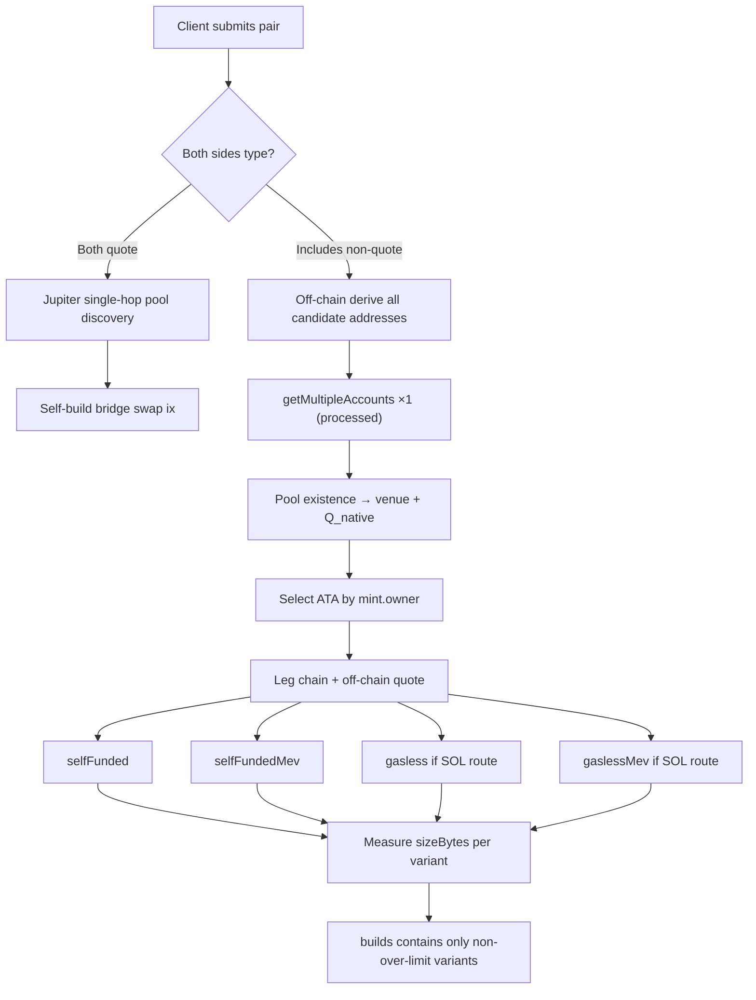

# ifx-launchpad-orchestrator — Development Plan

> **Goal:** Provide a unified transaction orchestration demo for three types of pre-graduation internal-market tokens — **Pump.fun bonding curve (non-AMM)**, **Raydium Launchpad (LaunchLab)**, and **Meteora DBC** — using the [Ifx Go SDK](https://github.com/ifx-run/ifx/tree/main/go-sdk).  
> **Constraints:** No wrapper contract deployment; fees / gasless / recipient changes are implemented via Ifx on-chain orchestration.

---

## 1. Project Scope & References

| Dimension | Description |
|-----------|-------------|
| **Form** | Go backend service (HTTP API) + optional lightweight static frontend; demo at the same level as [ifx-pumpfun-ext](https://github.com/ifx-run/ifx-pumpfun-ext) |
| **Language** | Go 1.22+, `github.com/ifx-run/ifx/go-sdk@v0.1.2` |
| **RPC** | `gagliardetto/solana-go`; internal-market accounts use **`processed`** commitment |
| **Ifx** | Shared Frame + `IxReset()` at the start of each tx; Structured CPI (SPL/System) + RawCpiPatch (DEX instructions) |
| **Non-goals** | Post-graduation **meme token** external-market trading (PumpSwap AMM, etc.); Jito bundle tx splitting; Token-2022 transfer-hook pools (may reject in v1) |
| **Exception** | **Quote swaps** (SOL/USDC/USDT) use **Jupiter single-hop pool discovery** + **self-built swap instructions** (no Jupiter-packaged tx) |

**Reusable Ifx patterns (Go SDK `examples/`):**

| Scenario | Reference |
|----------|-----------|
| Two-hop A→Quote→B, second-hop amount patched on-chain | `PlanTwoHopTokenSwapInstructions` |
| Sponsor pays + repay from proceeds | `PlanSponsoredBuyInstructions` |
| Close ATA only when balance is 0 | `PlanDustDestroyInstructions` / `ifx_if_else` |

**Business orchestration references (TypeScript, logic ported to Go):**

- [ifx-pumpfun-ext/docs/design.zh-CN.md](https://github.com/ifx-run/ifx-pumpfun-ext/blob/main/docs/design.zh-CN.md) — exact-in, inter-hop fees, topology
- [ifx-raydium-ext](https://github.com/ifx-run/ifx-raydium-ext) — sponsor, v0+ALT, 1232B size gate

---

## 2. Supported Transaction Shapes

### 2.1 Core constraint: one token, one quote

Each internal-market token **A can only be pooled against one quote** (denoted `Q_native(A)` ∈ {SOL, USDC, USDT}), determined by bonding curve / launchpad / DBC pool configuration.

User-facing payment/receipt assets are denoted `Q_pay` and `Q_recv` (each is one of SOL/USDC/USDT). When `Q_pay ≠ Q_native(A)` or `Q_recv ≠ Q_native(A)`, **a single hop cannot be assumed**; a **quote bridge leg** must be inserted (Jupiter single-hop pool discovery + self-built swap ix, see §2.5).

```text
Example: A is a SOL pool; user buys A with USDC
  USDC ──[quote_bridge]──► SOL ──[launchpad buy]──► A
         hop0 (quote bridge)     hop1 (internal market)

Example: A is a SOL pool; user sells A for USDT
  A ──[launchpad sell]──► SOL ──[quote_bridge]──► USDT
         hop0 (internal market)   hop1 (quote bridge)
```

### 2.2 Route = ordered Leg chain

Each transaction is a **Leg chain** (1–3 legs, v1 cap 3); **exact-in** throughout, with `min_out` slippage protection on the final leg output side.

| Leg type | Program | Role |
|----------|---------|------|
| **`launchpad`** | Pump / Raydium LP / Meteora DBC | base ↔ that pool's `Q_native` |
| **`quote_bridge`** | Low-account-count AMM (v1: **AMM v4 / CPMM**) | SOL ↔ USDC ↔ USDT single-hop conversion |

**Typical routes (hop count):**

| User intent | Condition | Path | hops |
|-------------|-----------|------|------|
| **Buy A** | `Q_pay == Q_native(A)` | launchpad buy | 1 |
| **Buy A** | `Q_pay ≠ Q_native(A)` | `Q_pay → Q_native → A` | 2 |
| **Sell A** | `Q_recv == Q_native(A)` | launchpad sell | 1 |
| **Sell A** | `Q_recv ≠ Q_native(A)` | `A → Q_native → Q_recv` | 2 |
| **Swap B** | `Q_native(A) == Q_native(B)` | `A → Q → B` (dual launchpad) | 2 |
| **Swap B** | `Q_native(A) ≠ Q_native(B)` | `A → Q_A → Q_B → B` (launchpad + bridge + launchpad) | 3 |

> **Unified wording:** “A ↔ SOL/USDC/USDT” describes **user-visible payment/receipt assets**, not “always exactly one launchpad instruction.” The Planner expands user intent into a Leg chain.

**Ifx responsibility:** Each hop (including bridge) gets `amount_in` from the previous hop's on-chain actual output (`ifx_let` + `rawCpiPatch` / structured patch), avoiding TOCTOU.

### 2.3 Routing matrix (user perspective)

The client submits a **`pair`**: `inputMint` + `outputMint` + `inputAmount` (exact-in side quantity). The backend branches based on whether each side is a quote token:

| `inputMint` | `outputMint` | Branch |
|-------------|--------------|--------|
| quote | quote | **Quote swap** (SOL↔U single-hop; see §2.5) |
| quote | non-quote | **Buy** the non-quote side |
| non-quote | quote | **Sell** the non-quote side |
| non-quote | non-quote | **Swap** A→B (both sides probed on internal market) |

> Quote token set v1: `SOL` (includes WSOL mint), `USDC`, `USDT` (fixed pubkeys in config table).

The Planner expands the pair into the Leg chain corresponding to “buy / sell / swap B” in the table above (§2.2).

### 2.4 Unified abstraction across three channels (internal-market Leg)

```go
// internal/venue/venue.go — conceptual interface
type Venue interface {
    ID() VenueID // pumpfun | raydium_launchpad | meteora_dbc

    // Resolve mint → pre-graduation pool state; return ErrGraduated if graduated
    Resolve(ctx context.Context, mint solana.PublicKey) (*PoolState, error)

    // Off-chain quote (exact-in)
    Quote(ctx context.Context, req QuoteRequest) (*QuoteResult, error)

    // Return DEX swap/buy/sell instruction template (amount fields may be 0 for RawCpiPatch)
    BuildSwapIx(ctx context.Context, plan SwapPlan) (solana.Instruction, *IxPatchMeta, error)
}
```

Each venue is an independent package; parallel to **`internal/bridge`** (quote bridge), assembled into Leg chains by **`internal/route`**.

### 2.5 Quote swap (SOL / USDC / USDT single-hop)

**Jupiter is for route discovery only, not execution.** Do not use Jupiter's returned swap instructions or packaged tx (equivalent to extra wrapping, wasted bytes); we only need it to tell us **which single-hop pool** is best.

**Hard pool-selection constraint: prefer pools with fewer accounts.** The full tx must also fit Ifx Frame, internal-market legs, fees, `UnwrapLamports`, compute budget, optional Jito tip; bridge legs using CLMM / Whirlpool / DLMM (requiring tick/bin arrays) can alone need 15–20+ accounts per leg, easily triggering the **1232B** gate. Therefore v1 **only connects flat pools**, selecting by ascending **`swap_ix_accounts`**.

```text
pair(USDC, SOL) pure quote swap:
  Jupiter Quote API (dexes restricted to low-account DEXes)
       → single-hop pool { type, poolId, inAmount, outAmount }
       → type ∈ whitelist AND accounts ≤ max_swap_accounts
       → in-house bridge builder constructs swap ix
       → snapshot RPC fetches pool accounts → Ifx orchestration + four-variant build

USDC→SOL segment in internal-market bridge leg (USDC→SOL→A):
  Same as above — shares bridge module with pure quote swap
```

| Item | Description |
|------|-------------|
| **Jupiter input** | `inputMint`, `outputMint`, `amount`; **`onlyDirectRoutes=true`**; **`dexes`** limited to low-account DEXes (see table below) |
| **Jupiter output (what we consume)** | `poolId`, `label` (pool type), `inAmount`, `outAmount`, `priceImpact` |
| **Do not consume** | `swapTransaction`, multi-hop routes, unknown-program pre-built ix |
| **Account budget** | Each bridge `swap` ix statically **`swap_ix_accounts ≤ bridge.max_swap_accounts`** (default **13**); types exceeding budget are not whitelisted |
| **Selection order** | ① Whitelist + account budget ② Within same type, max `outAmount` (Jupiter quote) ③ Still exceeds overall `MaxTxBytes` → omit that build variant |
| **SOL** | WSOL ATA + wrap/unwrap; SOL-side fees use `UnwrapLamports` (§4.1) |
| **Ifx** | Same as launchpad leg: `let(spendable_in)` → patch `amount_in` |

**v1 quote pool types (sorted by swap ix account count, flat pools only):**

| Priority | `PoolType` | Typical `swap_ix_accounts` | Typical pairs | Notes |
|----------|------------|---------------------------|---------------|-------|
| 1 | `raydium_amm_v4` | **~9** (V2 swap) | SOL-USDC | Fewest accounts; classic constant-product |
| 2 | `raydium_cpmm` | **~11–13** | SOL-USDC, SOL-USDT | Reuse [ifx-raydium-ext](https://github.com/ifx-run/ifx-raydium-ext); Token-2022 |
| — | `orca_whirlpool` | **~12 + tick arrays → 15–20+** | — | **Disabled by default in v1** (size risk) |
| — | `raydium_clmm` / `meteora_dlmm` etc. | **20+** | — | **Never connect** |

> Jupiter `dexes` recommendation: `Raydium` (covers AMM v4 + CPMM), **do not** include `Orca Whirlpool` / `Meteora DLMM` / `Raydium CLMM`. If Jupiter's top pick is unsupported or exceeds account budget → `ErrUnsupportedPoolType` or static **`bridge.fallback_pools`** (configure known low-account pools).

**Jupiter discovery algorithm (v1):**

```text
1. dexes = jupiter.DexesForSupportedTypes(config.bridge.supported_types)
2. GET /quote?onlyDirectRoutes=true&dexes=...
3. routePlan must be 1 step, percent=100
4. label → PoolType; if accounts > max_swap_accounts → reject
5. Optional: quote each fallback_pools entry; pick best outAmount among budget-passing pools
```

**FetchPlan:** Quote bridge/swap legs merge the selected `poolId` and that type's **fixed** vault/config accounts into the snapshot (**do not** fetch tick/bin array dynamic accounts).

---

## 3. Technical Notes for Three Internal-Market Channels

### 3.1 Pump.fun (bonding curve v2, not PumpSwap AMM)

See also: [docs/venues/pumpfun.md](venues/pumpfun.md) · [docs/venues/pumpfun.zh-CN.md](venues/pumpfun.zh-CN.md)（中文）

| Item | Content |
|------|---------|
| **Program** | Pump bonding curve program (aligned with `@pump-fun/pump-sdk` v2) |
| **Instructions** | `buy_exact_quote_in_v2` (buy), `sell_v2` (sell); **forbid** exact-out `buy_v2` |
| **Quote** | SOL / USDC (per curve config) |
| **Graduation detection** | bonding curve account `complete == true` → reject |
| **Go implementation** | Port instruction builder from [pump-sdk](https://www.npmjs.com/package/@pump-fun/pump-sdk) / IDL (do not rely on potentially stale third-party Go SDKs) |
| **Ifx patch** | On two-hop routes, hop2 `spendable_quote_in` uses `ifx_let(quoteDelta)` + `rawCpiPatch` |

### 3.2 Raydium Launchpad (LaunchLab)

| Item | Content |
|------|---------|
| **Program** | `LanMV9sAd7wArD4vJFi2qDdfnVhFxYSUg6eADduJ3uj` |
| **Instructions** | `buyExactIn` / `sellExactIn` (`raydium.launchpad` module) |
| **Quote** | Usually SOL; some platform configs support USDC |
| **Graduation detection** | `PoolState` migration flag / quote reserve ≥ threshold |
| **Go implementation** | Reference [raydium-sdk-v2 launchpad layout](https://github.com/raydium-io/raydium-sdk-V2) + Anchor IDL for hand-written `BuildSwapIx` |
| **Note** | Unlike ifx-raydium-ext (CPMM), this is LaunchLab bonding curve only |

### 3.3 Meteora DBC

| Item | Content |
|------|---------|
| **Program** | `dbcij3LWUppWqq96dh6gJWwBifmcGfLSB5D4DuSMaqN` |
| **Instructions** | Prefer `swap2` (ExactIn); Rate Limiter pools need `SYSVAR_INSTRUCTIONS_PUBKEY` |
| **Quote** | SOL / USDC (determined by virtual pool config) |
| **Graduation detection** | curve complete / migration threshold reached |
| **Go implementation** | Reference [@meteora-ag/dynamic-bonding-curve-sdk](https://docs.meteora.ag/developer-guide/guides/dbc/overview) to port quote + ix |
| **WSOL** | SOL quote path needs wrap/unwrap helper ix (unified strategy with Raydium/Pump) |

---

## 4. Orchestration Features — Ifx Design

### 4.0 Pre-build strategy (hard rules)

| Dimension | Strategy |
|-----------|----------|
| **Platform fee** | **Collected on every tx**; all four builds **include** fee leg |
| **Build variants (4)** | From one quote, pre-build: `selfFunded` · `selfFundedMev` · `gasless` · `gaslessMev`; client toggles **without re-quoting** |
| **MEV** | Whether Jito tip instruction is included; **`*Mev` variants** append tip transfer at end of ix list |
| **Gasless eligibility** | Only when route **involves SOL assets** (native SOL or WSOL flows through any hop); **pure U/USDT paths unsupported** → omit `gasless` / `gaslessMev` |
| **Recipient** | Determined by request (default `= user`); **change → re-quote** |
| **Size gate** | Each variant **built independently** then measured for `sizeBytes`; over limit → **omit that variant** (no downgrade retry, no leg trimming) |
| **Do not pre-build** | Parameters unknown at request time and not obtainable on-chain within the same tx |

> All necessary information must be known before constructing the transaction; missing info fails at FetchPlan / request validation stage.

### 4.1 Platform fee (SOL / USDC / USDT only, mandatory)

**Principle:** Never charge internal-market meme tokens; base is always **SOL / USDC / USDT**; **operator fee cannot be disabled**.

Fee currency prefers to match the user's **visible boundary quote** (`Q_pay` or `Q_recv`); internal `Q_native` transitions in Leg chains do not involve platform fee.

| Scenario | Fee timing | Base | Notes |
|----------|------------|------|-------|
| **Buy A, single leg** (`Q_pay == Q_native`) | Before first leg | `Q_pay × bps` | Net amount enters launchpad |
| **Buy A, bridged** (`Q_pay ≠ Q_native`) | Before first leg | `Q_pay × bps` | Deduct from USDC → net USDC to bridge → SOL to launchpad |
| **Sell A, single leg** | After first leg | proceeds `Q_recv × bps` | Fee after launchpad outputs quote |
| **Sell A, bridged** | **After launchpad leg, before bridge leg** | proceeds `Q_native × bps` | e.g. after A→WSOL output, **`UnwrapLamports`→operator** (not WSOL SPL transfer), net WSOL then bridges |
| **A→B, same Q_native** | Between two launchpads | `quoteDelta × bps` | Same as pumpfun-ext two-hop |
| **A→B, cross Q_native** | After first launchpad | `delta × bps` on intermediate quote | May be before or after bridge, at boundary where **stablely measurable and still a quote token** |

Ifx implementation: `structuredCpi` / `structuredCpiPatch` for SPL transfers; subsequent legs patch with `expr.Sub(measured, fee)`.

**SOL fee: collect lamports, not WSOL**

| Item | Rule |
|------|------|
| **Operator receipt** | SOL fee goes to `service_fee.pubkey` **native lamports** (system account), **no** operator WSOL ATA required |
| **User has native SOL** | `SystemProgram.transfer` (`structuredCpiPatch.SystemTransfer`) |
| **User only has WSOL ATA** (common after swap/bridge) | SPL Token **`UnwrapLamports`** (discriminator `45`): transfer lamports directly from user's WSOL native token account → operator pubkey; **forbid** `TokenTransfer(WSOL)` for platform fee |
| **Why not closeAccount** | `UnwrapLamports` can **specify amount** and **does not close** WSOL ATA; subsequent legs can reuse the same WSOL account |

```text
After sell A→SOL (output in user WSOL ATA), collect fee:
  let(wsolBal) → letEval(fee) → UnwrapLamports(userWsolAta → operatorPubkey, amount=fee)
  → continue bridge / next leg (WSOL ATA retains net balance)
```

- **USDC/USDT:** `structuredCpiPatch.TokenTransfer` / `TokenTransferChecked` → operator **SPL ATA** (must be pre-created)
- **Ifx:** `UnwrapLamports` via `patchedcpi.StaticCpi` or `rawCpi` (if structured patch not covered); amount can be `patch`ed from `letEval(fee)`

Config: `service_fee.bps`, `service_fee.pubkey` (SOL direct-receipt address), operator ATA table per SPL quote.

### 4.2 Gasless / Sponsored Swap

**Mode:** Sponsor as **fee payer** (+ ATA rent); user signs swap authorization; after fill, repay sponsor from **proceeds**.

```
ixReset → let(baselines…) → [sponsor create ATAs] → let(ataCosts)
→ DEX swap(s) → [optional Jito tip, see §4.3]
→ let(after balances) → assert(proceeds >= repayTarget)
→ patched transfer → gasVault (sponsor)
```

| Item | Description |
|------|-------------|
| **gasVault** | `sponsor.pubkey` or `gas_treasury.pubkey` |
| **repay composition** | `txFee + priorityFee + ataRentCreated + jitoTipLamports + bufferBps` |
| **Repay source** | **Measurable SOL output** in route (native or after WSOL unwrap); see eligibility below |
| **Eligibility (hard)** | `RouteInvolvesSOL(route) == true`; otherwise **do not return** `gasless` / `gaslessMev` |
| **Pure U counterexample** | `USDC → A` (A is USDC pool, no bridge to SOL) — no SOL throughout → gasless unavailable |
| **SOL-inclusive examples** | `USDC→SOL→A`, `A→SOL`, `A→SOL→USDC`, etc. → gasless may be attempted |

**Why pure U/USDT unsupported:** Gasless repays sponsor from fill proceeds; without SOL flowing through the tx, no unified path for lamports repayment (avoids runtime SPL deduction from user U to pull extra state).

Server co-sign: sponsor keypair as fee payer; under gasless, tip is also **sponsor-funded** and included in repay.

### 4.3 MEV (Jito Tip)

| Item | Description |
|------|-------------|
| **Purpose** | `*Mev` variants append **Jito tip** `SystemProgram.transfer` → configured tip account |
| **Payer** | **selfFundedMev:** `feePayer` (user) pays tip directly; **gaslessMev:** sponsor pays tip, **included in §4.2 repay** |
| **RPC** | Actual landing requires **Jito-enabled RPC**; demo does not depend on bundle landing |
| **Test / demo** | **Hardcode `jito_tip_lamports = 0`** (or tiny constant like `1000`); avoid real fund loss in tests |
| **Config** | `[jito] tip_account`, `tip_lamports` (default `0`), `enabled` (whether to build `*Mev` variants) |

```go
// Only *Mev variants append; when tip is 0, keep placeholder ix (for inspector) or omit (implementation choice; doc allows omitting 0-tip)
if mode.HasMev() && cfg.JitoTipLamports > 0 {
    ixs = append(ixs, systemTransfer(feePayer, jitoTipAccount, cfg.JitoTipLamports))
}
```

### 4.4 Change recipient address (Recipient)

**Semantics:** `signer = user`, but **output base token** goes to `recipient`'s ATA (when `recipient ≠ user`).

**Strategy (by venue capability):**

1. **Preferred:** If DEX instruction supports specifying destination token account, fill `recipient ATA` when building ix (user remains authority/signer).
2. **Fallback (generic):** Swap output to **user temp ATA** → Ifx `structuredCpi tokenTransfer` → `recipient ATA` (+ idempotent create recipient ATA).
3. **Cross swap:** B token must ultimately reach `recipient`; hop1 quote from selling A still follows user/sponsor path.

**FetchPlan:** Once `recipientPubkey` is determined in request, both ATAs (legacy + Token-2022) and mint **included in the single RPC**.

**Client:** `recipientPubkey` change → **re-`POST /api/quote`**; do not pre-build tx for multiple recipients.

### 4.5 Composed topology examples

**Example 1: Buy SOL-pool token A with USDC (2 legs + fee + sponsor)**

```text
reset → let(baselines…) → [sponsor create ATAs] → let(ataCosts)
→ transfer serviceFee(USDC) → operator          // boundary fee
→ CPMM swap USDC→SOL (patched net USDC)
→ let(solFromBridge)
→ patched launchpad buy(A, solFromBridge)
→ [transfer A → recipient ATA if needed]
→ let(…) → assert → repay sponsor (SOL lamports; WSOL path UnwrapLamports first then repay)
```

**Example 2: A→B same Q_native (2 launchpad + inter-hop fee)**

```text
… → sell launchpad(A) → let(quoteDelta) → fee → patched buy(B, netQuote) → …
```

**Example 3: A (SOL pool) → B (USDC pool) (3 legs)**

```text
… → sell(A)→WSOL → UnwrapLamports(fee→operator) → CPMM WSOL→USDC → let(usdc) → patched buy(B, usdc) → …
```

---

## 5. Quote Pipeline (Core Architecture)

**Design goal:** Each `POST /api/quote` does **at most one RPC** on the account side; thereafter quote + **four** build variants are **zero IO**. Client toggling gasless / MEV only changes display, no re-quote.



### 5.1 Step 0 — Pair classification (zero IO)

```go
type PairClass int
const (
    PairQuoteSwap     // SOL↔USDC etc. — Jupiter pool discovery + self-built single-hop
    PairBuyLaunchpad  // quote → base
    PairSellLaunchpad // base → quote
    PairSwapLaunchpad // base → base
)
```

- Both sides quote → **Jupiter single-hop pool discovery** + `quote_bridge` leg (self-built ix); do not fetch internal-market bonding curve.
- Otherwise, for **each non-quote side**, assume it belongs to one of Pump / Raydium LP / Meteora DBC (pre-graduation), enter Step 1.

### 5.2 Step 1 — Off-chain derive candidate addresses (zero IO)

For each non-quote mint `M`, **simultaneously** compute all account pubkeys possibly needed across three channels (dedupe merge into `FetchPlan.Keys`):

| Category | Derived content |
|----------|-----------------|
| **Mint** | `M` itself (read `owner` → Token vs Token-2022) |
| **Three-channel pools** | Pump bonding curve PDA, Raydium launchpad pool PDA, Meteora DBC virtual pool PDA and respective vault / config / global **statically derivable** accounts |
| **Quote-related** | Pool-declared `Q_native` mint, corresponding vault |
| **Bridge** (quote swap / bridge leg) | Jupiter-returned `poolId` + vault/config accounts required for that type (merged into snapshot) |
| **User ATA** | For each involved `(owner, mint)`: derive both `ATA_legacy` + `ATA_token2022` |
| **Recipient ATA** | If `recipient ≠ user`, same dual derivation |
| **Sponsor / fee** | Operator quote ATA (config constant, no RPC) |

**Internal-market attribution:** After RPC returns, **which channel's pool main account is non-empty and decodable** → that mint's `venue`; if multiple exist (abnormal) → priority order or return `ErrAmbiguousVenue`; if none → `ErrNotLaunchpad`.

**ATA selection:** Read mint account `owner` first:

- `Tokenkeg…` → use `ATA_legacy` on-chain state (existence, balance)
- `TokenzQd…` → use `ATA_token2022`
- Both ATAs fetched in same RPC; **only consume the one matching mint program**

### 5.3 Step 2 — Single account RPC

```go
// internal/snapshot/fetch.go
func FetchSnapshot(ctx, plan FetchPlan) (*ChainSnapshot, error) {
    // Single getMultipleAccounts, commitment = processed
    // max batch may be sliced per RPC limit, but still presented to client as "one snapshot round"
}
```

`ChainSnapshot` is an immutable read-only cache containing:

- Decoded pool state (venue, graduation flag, `Q_native`, curve reserves)
- Mint metadata (decimals, token program)
- Selected user / recipient ATA existence and balance
- Bridge pool state (if route requires)

**Commitment:** Internal-market snapshot always **`processed`**.

**Blockhash:** May **parallel** one `getLatestBlockhash` with account RPC (not counted in "account snapshot"), or client refreshes before signing; **no account fetch during tx build stage**.

### 5.4 Step 3 — IO-free: Quote + four-variant Build

```go
type BuildVariant uint8
const (
    VariantSelfFunded      // user pays gas, no tip
    VariantSelfFundedMev   // user pays gas + Jito tip
    VariantGasless      // sponsor pays + SOL proceeds repay (tip included in repay)
    VariantGaslessMev   // sponsor pays + tip included in repay
)

func PrepareQuote(snapshot *ChainSnapshot, req QuoteRequest) (*QuoteResponse, error) {
    route := PlanLegs(snapshot, req)
    quote := SimulateExactIn(route, req)

    gaslessOK := RouteInvolvesSOL(route, snapshot)
    variants := []BuildVariant{
        VariantSelfFunded, VariantSelfFundedMev,
    }
    if gaslessOK {
        variants = append(variants, VariantGasless, VariantGaslessMev)
    }

    builds := map[string]*BuildResult{}
    for _, v := range variants {
        tx, err := BuildTx(snapshot, route, v, req)
        if err != nil { recordUnsupported(v, err); continue }
        if tx.SizeBytes > MaxTxBytes { recordUnsupported(v, ErrTxTooLarge); continue }
        builds[v.Key()] = tx
    }
    return &QuoteResponse{Route: route, Quote: quote, Builds: builds, Capabilities: ...}, nil
}
```

| Variant | fee payer | Jito tip | Preconditions |
|---------|-----------|----------|---------------|
| **selfFunded** | user | none | none |
| **selfFundedMev** | user | user transfers `tip_lamports` | `jito.enabled` |
| **gasless** | sponsor | none | `RouteInvolvesSOL` |
| **gaslessMev** | sponsor | sponsor pays tip, **included in repay** | above + `jito.enabled` |

All four variants share the same `ChainSnapshot`, `route`, `quote`; **all include fee leg**.

**Client contract:**

| Action | Re-quote? |
|--------|-----------|
| Toggle **gasless** / **MEV** | **No** — read `builds.*` |
| Change recipient / pair / amount / slippage / user | **Yes** |
| Variant missing | Hide corresponding UI toggle; `capabilities` gives `reason` |

### 5.5 Step 4 — Size gate (per variant, post-build check)

| Item | Description |
|------|-------------|
| **Timing** | Measure `len(serializedTx)` **after each variant fully builds tx** |
| **Limit** | `MaxTxBytes` (v0 compiled byte count, same as pumpfun-ext, default **1232**) |
| **Over limit** | **Drop that variant**, no leg trimming, no downgrade; `capabilities.<variant>.supported = false`, `reason: "tx_too_large"` |

### 5.6 Quote swap path (both quote)

```text
1. Jupiter GET /quote?onlyDirectRoutes=true&dexes=…  → parse best single-hop routePlan
2. Validate `PoolType` ∈ whitelist AND `swap_ix_accounts ≤ max_swap_accounts`
3. FetchPlan += pool fixed accounts (no tick/bin array)
4. Off-chain quote + four-variant build → post-build `tx_size` gate
```

- **Response `source`:** `"quote_swap"` (distinct from `"launchpad"`)
- **Unified with internal-market response:** Same `route.legs[]`, `builds.{selfFunded,…}`, `quote`; **no** Jupiter serialized tx
- **Jupiter failure / unsupported pool type:** Optional static `bridge.fallback_pools` (configured by `pool_type`)

### 5.7 Cache (startup / low frequency)

| Data | Strategy |
|------|----------|
| ALT accounts | Load at startup, refresh every few minutes; tx build uses memory only |
| Quote mint table, bridge fallback pools | Config-fixed |
| Jupiter pool discovery | HTTP per request (quote swap + bridge leg pool selection); **do not download swap tx** |
| Jito tip | Config hardcoded `tip_lamports` (default 0), no runtime RPC |

**Forbidden:** RPC calls inside `BuildTx` / `PlanLegs` / `SimulateExactIn`; if snapshot missing accounts → treat as **FetchPlan derivation omission**, fix planner not runtime refetch.

---

## 6. Module Structure

```text
ifx-launchpad-orchestrator/
├── cmd/server/main.go              # HTTP entry
├── config.example.toml
├── internal/
│   ├── config/                     # TOML: RPC, ifx, fee, sponsor, ALT, quotes
│   ├── solana/
│   │   ├── client.go               # RPC wrapper, commitment
│   │   ├── batch.go                # getMultipleAccounts (single snapshot)
│   │   ├── ata.go                  # legacy + token2022 dual derivation
│   │   ├── alt.go                  # v0 compile (in-memory ALT)
│   │   └── blockhash.go
│   ├── snapshot/
│   │   ├── fetch_plan.go           # Candidate pubkey union derivation
│   │   ├── fetch.go                # Single RPC → ChainSnapshot
│   │   └── detect.go               # Pool hit → venue; mint.owner → ATA
│   ├── jupiter/
│   │   ├── discover.go             # Quote API: parse single-hop poolId + poolType only
│   │   └── map_label.go            # Jupiter label → internal PoolType
│   ├── venue/
│   │   ├── venue.go                # LaunchpadVenue interface + VenueID
│   │   ├── pumpfun/
│   │   ├── raydium_launchpad/
│   │   └── meteora_dbc/
│   ├── bridge/
│   │   ├── types.go                # PoolType + swap_ix_accounts constants
│   │   ├── router.go               # poolType → SwapBuilder
│   │   ├── raydium_amm_v4.go       # ~9 accounts, connect first
│   │   ├── raydium_cpmm.go
│   │   └── fallback.go             # Static low-account pools (skip Jupiter or fallback)
│   ├── route/
│   │   ├── planner.go              # inputMint/outputMint → []Leg
│   │   ├── leg.go                  # Leg { launchpad | quote_bridge }
│   │   └── quote.go                # Multi-leg chained quote
│   ├── orchestrator/
│   │   ├── planner.go              # snapshot + route → four-variant PrepareBuilds
│   │   ├── build.go                # BuildTx(variant) IO-free
│   │   ├── variants.go             # selfFunded / selfFundedMev / gasless / gaslessMev
│   │   ├── gasless_eligibility.go  # RouteInvolvesSOL
│   │   ├── tx_size.go              # Post-build MaxTxBytes gate
│   │   ├── jito.go                 # tip ix; tip_lamports default 0
│   │   ├── leg_chain.go            # Generic N-leg patch chain (1–3)
│   │   ├── trade_buy.go
│   │   ├── trade_sell.go
│   │   ├── swap_ab.go
│   │   ├── service_fee.go          # Fee collection; SOL via UnwrapLamports / SystemTransfer
│   │   ├── spl_unwrap.go           # UnwrapLamports ix template + optional patch
│   │   ├── sponsor.go              # Sponsor pay + repay
│   │   ├── recipient.go            # Recipient ATA + transfer
│   │   ├── smart_close.go          # Conditional ATA close
│   │   └── frames.go               # Random shared Frame
│   └── api/
│       ├── handler.go
│       └── types.go                # JSON DTO
├── pkg/inspect/                      # tx instruction inspector (optional, from pumpfun-ext)
└── docs/
    ├── plan.md                     # This document
    ├── plan.zh-CN.md               # Chinese version
    ├── venues/
    │   ├── pumpfun.md
    │   └── pumpfun.zh-CN.md
    └── design.zh-CN.md             # API/topology details after Phase 1
```

---

## 7. Transaction Size Gate (per variant)

**Principle:** No downgrade, no leg trimming; over limit **only omits that build variant**.

| Check order | Condition | Result |
|-------------|-----------|--------|
| 1 | `!RouteInvolvesSOL` and variant is `gasless*` | Skip tx build, `reason: no_sol_in_route` |
| 2 | `!jito.enabled` and variant is `*Mev` | Skip, `reason: jito_disabled` |
| 3 | Tx build complete | `sizeBytes > MaxTxBytes` → omit, `reason: tx_too_large` |
| 4 | Pass | Write to `builds.<variant>` |

**Means:** v0 + ALT; merge `ifx_let`; `jito_tip_lamports = 0` reduces demo size and fund risk.

**Minimum guarantee:** Usually at least one variant available (often `selfFunded`); if all four unavailable → HTTP 413 / 422 + detailed `capabilities`.

---

## 8. Phased Implementation Plan

### Phase 0 — Scaffolding (1–2 days)

- [ ] `go mod init`, add `ifx/go-sdk@v0.1.2`, `solana-go`
- [ ] `config.example.toml`: RPC, quote mints, Jupiter, `[jito] tip_lamports=0`, ifx frames, fee, sponsor, ALT
- [ ] `cmd/server` + `GET /api/health`, `GET /api/config/public`
- [ ] `snapshot/fetch.go` + `solana/batch.go`: single `getMultipleAccounts(processed)`

### Phase 1 — Snapshot probe + routing + quote (no Ifx) (5–7 days)

- [ ] **`snapshot/fetch_plan.go`**: three-channel pool PDA union + mint + dual ATA + bridge pools
- [ ] **`snapshot/detect.go`**: pool account hit → `venue` + `Q_native`; mint.owner → ATA selection
- [ ] **Jupiter discover** + `bridge` whitelist (**account count ≤13**); start with `raydium_cpmm` + `raydium_amm_v4`
- [ ] **`route/planner.go`**: expand Leg chain from snapshot (1–3 legs), memory only
- [ ] Three venue pool decode + off-chain exact-in quote chaining
- [ ] `POST /api/quote` — one RPC then return `route` + `quote` (no build yet)

### Phase 2 — Four-variant IO-free Build (4–5 days)

- [ ] `variants.go` + `build.go` — four variants build tx
- [ ] `gasless_eligibility.go` — `RouteInvolvesSOL`; omit gasless* for pure U
- [ ] `jito.go` — tip ix; `tip_lamports` default **0**
- [ ] `tx_size.go` — post-build `MaxTxBytes` gate, omit per variant
- [ ] `spl_unwrap.go` — `UnwrapLamports` template; SOL fee from WSOL ATA to operator pubkey
- [ ] `service_fee.go` — mandatory fee in all four variants; **SOL never collected as WSOL SPL**
- [ ] Zero-RPC assertion on build path

### Phase 2b — 1-leg native quote end-to-end (2–3 days)

- [ ] Verify buy/sell on all three channels (four-variant matrix + size gate)
- [ ] v0 + ALT compile

### Phase 2b — Quote bridge buy/sell (2 legs) (3–4 days)

- [ ] `USDC→SOL→A` / `A→SOL→USDC` etc. bridged buy/sell
- [ ] Ifx: `let(bridgeOut)` → patch launchpad leg (or reverse)
- [ ] Bridge scenario fees and sponsor repay

### Phase 3 — Swap A→B (2–3 legs) (3–4 days)

- [ ] Same `Q_native`: dual launchpad + inter-hop fee
- [ ] Different `Q_native`: sell + bridge + buy (3 legs)
- [ ] Conditional close input ATA (`ifx_if_else`)

### Phase 4 — Recipient + full feature combination (3–4 days)

- [ ] `recipient.go` — snapshot already includes recipient dual ATA; post-swap transfer
- [ ] Gasless pure U path regression: `capabilities.gasless.reason = no_sol_in_route`
- [ ] Four variants + recipient re-quote + `tip_lamports=0` integration
- [ ] `POST /api/tx/simulate` (simulate allows extra RPC, but does not trigger snapshot re-fetch)

### Phase 5 — Polish & documentation (2–3 days)

- [ ] Optional static UI (wallet, quote, inspector)
- [ ] `docs/design.zh-CN.md` — API, Ifx ix order table, per-venue account lists
- [ ] ALT extend script + address manifest
- [ ] README: quick start, mainnet example tx links

**Estimated total:** 18–26 working days (solo, familiar with Solana / Ifx; includes quote bridge)

---

## 9. API Draft

| Method | Path | Description |
|--------|------|-------------|
| GET | `/api/health` | Health check |
| GET | `/api/config/public` | debounce, default slippage, fee bps, quote mints |
| POST | `/api/quote` | **Main entry**: pair → one snapshot RPC → quote + **four variants** build |
| POST | `/api/tx/simulate` | Simulate returned serialized tx (optional) |

> v1 **does not** expose standalone `/api/token/resolve`: venue probing is embedded in quote's single RPC.

**Quote Request:**

```json
{
  "inputMint": "EPjF…",
  "outputMint": "TokenA…",
  "inputAmount": "100",
  "slippageBps": 100,
  "userPubkey": "...",
  "recipientPubkey": "...",
  "priorityTier": "medium"
}
```

> `recipientPubkey` may be omitted (defaults to `= userPubkey`). **No** `features.serviceFee` — fee always collected, `service_fee.bps` from server config.

**Quote Response (launchpad path):**

```json
{
  "source": "launchpad",
  "pairClass": "buy",
  "detected": {
    "baseMint": "TokenA…",
    "venue": "pumpfun",
    "nativeQuoteMint": "So11…",
    "graduated": false,
    "tokenProgram": "Tokenkeg…",
    "userAta": "…"
  },
  "route": {
    "legs": [
      { "kind": "quote_bridge", "pair": "USDC/SOL" },
      { "kind": "launchpad", "venue": "pumpfun" }
    ],
    "hopCount": 2
  },
  "quote": {
    "inputRaw": "100000000",
    "expectedOutputRaw": "…",
    "minOutputRaw": "…",
    "serviceFeeRaw": "…"
  },
  "builds": {
    "selfFunded": { "txBase64": "…", "feePayer": "user…", "sizeBytes": 1180 },
    "selfFundedMev": { "txBase64": "…", "feePayer": "user…", "jitoTipLamports": "0", "sizeBytes": 1195 },
    "gasless": { "txBase64": "…", "feePayer": "sponsor…", "repayEstimateLamports": "…", "sizeBytes": 1256 },
    "gaslessMev": { "txBase64": "…", "feePayer": "sponsor…", "repayEstimateLamports": "…", "jitoTipLamports": "0", "sizeBytes": 1270 }
  },
  "capabilities": {
    "selfFunded":       { "supported": true },
    "selfFundedMev":    { "supported": true },
    "gasless":       { "supported": false, "reason": "no_sol_in_route" },
    "gaslessMev":    { "supported": false, "reason": "no_sol_in_route" }
  },
  "blockhash": "…",
  "lastValidBlockHeight": 0
}
```

- Response **only includes** `builds.*` keys for variants where `capabilities.*.supported == true`
- Pure **quote swap** uses `source: "quote_swap"`; `route.legs[0].kind = quote_bridge`
- **Both quote** and launchpad **share** `builds` four-variant shape; **no** Jupiter packaged instructions

**Client behavior:**

| UI action | Behavior |
|-----------|----------|
| Gasless | Toggle between returned `gasless` / `gaslessMev` tx; both missing → disable |
| MEV | Toggle between `*Mev` and non-Mev variants; `*Mev` missing → disable |
| Change recipient | **Re-** `/api/quote` |
| Fee | Read-only `quote.serviceFeeRaw` |

---

## 10. Testing Strategy

| Layer | Content |
|-------|---------|
| **Unit** | FetchPlan, detect, ATA selection, quote math, **UnwrapLamports encoding** |
| **Planner** | Table-driven: ix order, patch offset; **mock snapshot, no RPC** |
| **IO guard** | Build package tests: hook RPC client assert zero calls |
| **Integration** | Mainnet simulate (small amount / read-only); record example tx in README |
| **Regression** | Four variants × size gate; pure U no gasless; `tip_lamports=0` |

---

## 11. Risks & Open Questions

| Risk | Mitigation |
|------|------------|
| Third-party Go SDK inconsistent with v2 instructions | **In-house ix builder**, official TS SDK / IDL as source of truth |
| 1232B limit | **Per-variant** post-build check; omit over-limit variant; bridge **forbids** tick/bin pools |
| Bridge pool too many accounts | Whitelist + `max_swap_accounts`; Jupiter `dexes` Raydium flat pools only |
| Jito test fund loss | **`jito.tip_lamports = 0`** (default); increase + Jito RPC at launch |
| Bridge pool liquidity / pool missing | Bridge pool pubkey in FetchPlan; validate after snapshot |
| FetchPlan missing accounts | Unit tests cover all routes; build forbids refetch RPC |
| Three-channel pools coexist | Ambiguous detection → `ErrAmbiguousVenue` or fixed priority with logging |
| Incomplete USDT support | v1 dynamically enable per pool actual quote mint; reject at resolve if unsupported |
| Token-2022 / transfer hook | Reject after detection in v1 with message |
| Ifx no third-party audit | Demo disclaimer; pin SDK version |

**Confirmed architecture:**

1. Pair-driven; both quote → **Jupiter single-hop pool discovery + self-built bridge ix**
2. Non-quote side: three-channel pool address union + **one RPC** venue probe
3. ATA: legacy + Token-2022 dual derivation, fetched with mint in same batch
4. **Four variants** pre-built: `selfFunded` · `selfFundedMev` · `gasless` · `gaslessMev`; gasless SOL routes only; tip default 0
5. **Recipient change → re-quote**
6. **Post-build size gate**: over-limit variants not returned
7. **SOL platform fee**: collect **native lamports**; WSOL source uses **`UnwrapLamports`**, not WSOL SPL

**To confirm:**

1. Jupiter label → `PoolType` mapping table (expand as v1 pool types are implemented)
2. When `getMultipleAccounts` exceeds RPC single-call limit, still expose as "one snapshot round" to client?
3. When Jupiter top pick is unsupported pool type: hard fail vs `fallback_pools` downgrade (**fallback must be low-account static pools**)

---

## 12. Next Actions

1. **Confirm** §11 open questions  
2. **Execute Phase 0**: Initialize Go module, config, RPC batch layer  
3. **Parallel research**: Export three "minimal ix account table + data layout" docs from pump-sdk / raydium-sdk-v2 / meteora-dbc-sdk to `docs/venues/` — see [pumpfun.md](venues/pumpfun.md) / [pumpfun.zh-CN.md](venues/pumpfun.zh-CN.md)  
4. **Implement `snapshot` + four-variant build + `tx_size` gate first**, then fill FetchPlan per channel  

---

*Document version: 2026-07-06 (rev.8: bridge prefers low-account flat pools, Whirlpool/CLMM/DLMM disabled) · Update `docs/design.zh-CN.md` as implementation progresses · [中文计划](plan.zh-CN.md)*
