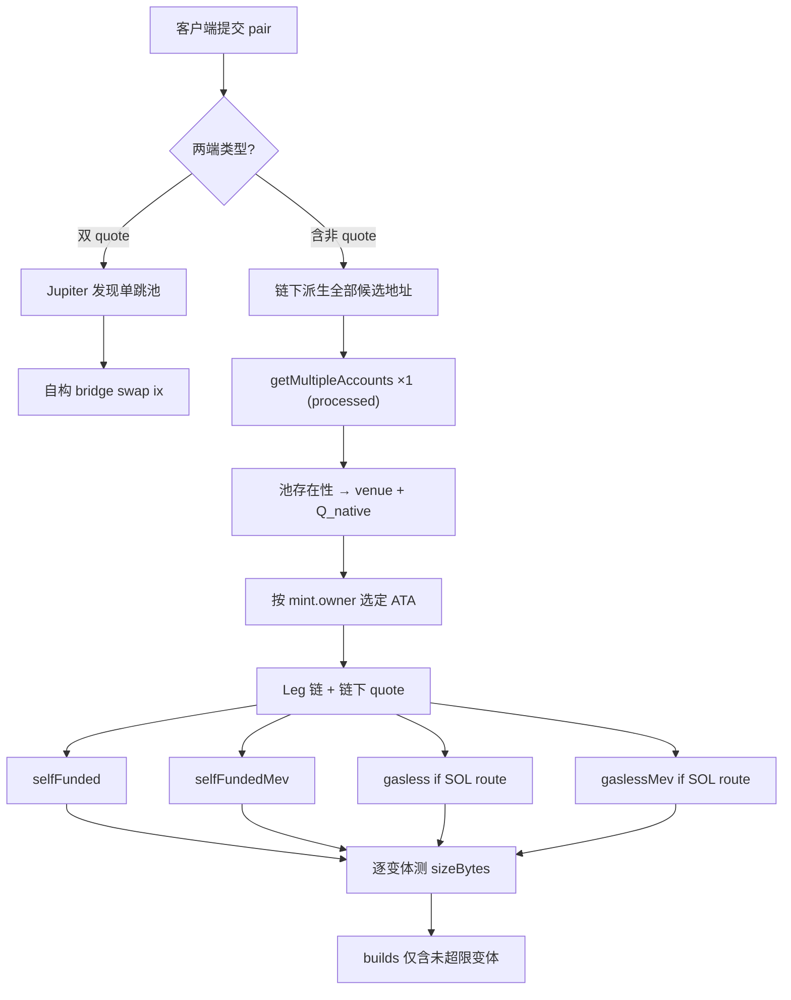

# ifx-launchpad-orchestrator — 开发计划

> **目标：** 使用 [Ifx Go SDK](https://github.com/ifx-run/ifx/tree/main/go-sdk) 为 **Pump.fun bonding curve（非 AMM）**、**Raydium Launchpad（LaunchLab）**、**Meteora DBC** 三类内盘未毕业代币，提供统一的交易编排 demo。  
> **约束：** 不部署 wrapper 合约；手续费 / gasless / 改接收者均通过 Ifx 链上编排实现。

---

## 1. 项目定位与参考

| 维度 | 说明 |
|------|------|
| **形态** | Go 后端服务（HTTP API）+ 可选轻量静态前端；与 [ifx-pumpfun-ext](https://github.com/ifx-run/ifx-pumpfun-ext) 同级 demo |
| **语言** | Go 1.22+，`github.com/ifx-run/ifx/go-sdk@v0.1.2` |
| **RPC** | `gagliardetto/solana-go`；内盘账户用 **`processed`** commitment |
| **Ifx** | 公共 Frame + 每笔 tx 开头 `IxReset()`；Structured CPI（SPL/System）+ RawCpiPatch（DEX 指令） |
| **非目标** | 已毕业 **meme 代币** 的外盘交易（PumpSwap AMM 等）；Jito bundle 拆 tx；Token-2022 transfer-hook 池（v1 可拒绝） |
| **例外** | **Quote 互换**（SOL/USDC/USDT）走 **Jupiter 发现单跳池** + **自构 swap 指令**（不用 Jupiter 打包 tx） |

**可复用的 Ifx 模式（Go SDK `examples/`）：**

| 场景 | 参考 |
|------|------|
| 两跳 A→Quote→B，第二跳 amount 链上 patch | `PlanTwoHopTokenSwapInstructions` |
| Sponsor 代付 + 从 proceeds 偿还 | `PlanSponsoredBuyInstructions` |
| 余额为 0 才 close ATA | `PlanDustDestroyInstructions` / `ifx_if_else` |

**业务编排参考（TypeScript，逻辑移植到 Go）：**

- [ifx-pumpfun-ext/docs/design.zh-CN.md](https://github.com/ifx-run/ifx-pumpfun-ext/blob/main/docs/design.zh-CN.md) — 精确输入、跳间手续费、拓扑
- [ifx-raydium-ext](https://github.com/ifx-run/ifx-raydium-ext) — sponsor、v0+ALT、1232B 体积门控

---

## 2. 支持的交易形态

### 2.1 核心约束：一币一 quote

每个内盘代币 **A 只能以一种 quote 建池**（记为 `Q_native(A)` ∈ {SOL, USDC, USDT}），由 bonding curve / launchpad / DBC 池配置决定。

用户侧可用的支付/收款资产记为 `Q_pay`、`Q_recv`（均为 SOL/USDC/USDT 之一）。当 `Q_pay ≠ Q_native(A)` 或 `Q_recv ≠ Q_native(A)` 时，**不能假设单跳**，必须插入 **quote 桥接腿**（Jupiter 发现单跳池 + 自构 swap ix，见 §2.5）。

```text
示例：A 为 SOL 池，用户用 USDC 买入 A
  USDC ──[quote_bridge]──► SOL ──[launchpad buy]──► A
         hop0 (quote桥)         hop1 (内盘)

示例：A 为 SOL 池，用户卖出 A 换 USDT
  A ──[launchpad sell]──► SOL ──[quote_bridge]──► USDT
         hop0 (内盘)            hop1 (quote桥)
```

### 2.2 路由 = 有序 Leg 链

每笔交易是一条 **Leg 链**（1–3 腿，v1 上限 3）；全程 **exact-in**，末腿输出侧用 `min_out` 做滑点保护。

| Leg 类型 | 程序 | 作用 |
|----------|------|------|
| **`launchpad`** | Pump / Raydium LP / Meteora DBC | base ↔ 该池 `Q_native` |
| **`quote_bridge`** | 低账户数 AMM（v1：**AMM v4 / CPMM**） | SOL ↔ USDC ↔ USDT 单跳互转 |

**典型路由（hop 数）：**

| 用户意图 | 条件 | 路径 | hops |
|----------|------|------|------|
| **买 A** | `Q_pay == Q_native(A)` | launchpad buy | 1 |
| **买 A** | `Q_pay ≠ Q_native(A)` | `Q_pay → Q_native → A` | 2 |
| **卖 A** | `Q_recv == Q_native(A)` | launchpad sell | 1 |
| **卖 A** | `Q_recv ≠ Q_native(A)` | `A → Q_native → Q_recv` | 2 |
| **换 B** | `Q_native(A) == Q_native(B)` | `A → Q → B`（双 launchpad） | 2 |
| **换 B** | `Q_native(A) ≠ Q_native(B)` | `A → Q_A → Q_B → B`（launchpad + bridge + launchpad） | 3 |

> **统一表述：** 「A ↔ SOL/USDC/USDT」描述的是 **用户可见的支付/收款资产**，不是「永远只有一条 launchpad 指令」。Planner 负责把用户意图展开为 Leg 链。

**Ifx 职责：** 每一跳（含 bridge）的 `amount_in` 均来自上一跳链上实际产出（`ifx_let` + `rawCpiPatch` / structured patch），避免 TOCTOU。

### 2.3 路由矩阵（用户视角）

客户端提交 **`pair`**：`inputMint` + `outputMint` + `inputAmount`（精确输入侧数量）。后端根据两端是否为 quote 代币分流：

| `inputMint` | `outputMint` | 分流 |
|-------------|--------------|------|
| quote | quote | **Quote swap**（SOL↔U 等单跳；见 §2.5） |
| quote | 非 quote | **买** 非 quote 端 |
| 非 quote | quote | **卖** 非 quote 端 |
| 非 quote | 非 quote | **Swap** A→B（两端均走内盘探测） |

> quote 代币集合 v1：`SOL`（含 WSOL mint）、`USDC`、`USDT`（配置表固定 pubkey）。

Planner 将 pair 展开为上表「买 / 卖 / 换 B」对应的 Leg 链（§2.2）。

### 2.4 三渠道统一抽象（内盘 Leg）

```go
// internal/venue/venue.go — 概念接口
type Venue interface {
    ID() VenueID // pumpfun | raydium_launchpad | meteora_dbc

    // 解析 mint → 未毕业池状态；已毕业返回 ErrGraduated
    Resolve(ctx context.Context, mint solana.PublicKey) (*PoolState, error)

    // 链下报价（精确输入）
    Quote(ctx context.Context, req QuoteRequest) (*QuoteResult, error)

    // 返回 DEX swap/buy/sell 指令模板（amount 字段可留 0，供 RawCpiPatch）
    BuildSwapIx(ctx context.Context, plan SwapPlan) (solana.Instruction, *IxPatchMeta, error)
}
```

各 venue 独立 package；与 **`internal/bridge`**（quote 桥）并列，由 **`internal/route`** 组装 Leg 链。

### 2.5 Quote 互换（SOL / USDC / USDT 单跳）

**Jupiter 只做路由发现，不做执行。** 不用 Jupiter 返回的 swap 指令或打包 tx（相当于额外包装、浪费字节）；只要它告诉我们 **哪一条单跳池** 最优。

**池选型硬约束：优先账户数少的池。** 整笔 tx 还要塞 Ifx Frame、内盘腿、手续费、`UnwrapLamports`、compute budget、可选 Jito tip；bridge 腿若用 CLMM / Whirlpool / DLMM（需 tick/bin array），单腿账户即可 15–20+，极易触发 **1232B** 门控。故 v1 **只接 flat 池**，并按 **`swap_ix_accounts` 升序** 选池。

```text
pair(USDC, SOL) 纯 quote 互换:
  Jupiter Quote API（dexes 限制为低账户 DEX）
       → 单跳 pool { type, poolId, inAmount, outAmount }
       → type ∈ 白名单 且 accounts ≤ max_swap_accounts
       → 自研 bridge builder 构 swap ix
       → snapshot RPC 拉 pool 账户 → Ifx 编排 + 四变体 build

内盘桥接腿（USDC→SOL→A）中的 USDC→SOL 段:
  同上 — 与纯 quote 互换共用 bridge 模块
```

| 项 | 说明 |
|----|------|
| **Jupiter 输入** | `inputMint`、`outputMint`、`amount`；**`onlyDirectRoutes=true`**；**`dexes`** 仅含低账户 DEX（见下表） |
| **Jupiter 输出（我们消费的）** | `poolId`、`label`（池类型）、`inAmount`、`outAmount`、`priceImpact` |
| **不消费** | `swapTransaction`、多跳 route、未知 program 预构 ix |
| **账户预算** | 每个 bridge `swap` ix 静态 **`swap_ix_accounts ≤ bridge.max_swap_accounts`**（默认 **13**）；超限类型不进白名单 |
| **选型顺序** | ① 白名单 + 账户预算 ② 同类型内 `outAmount` 最大（Jupiter quote）③ 仍超整体 `MaxTxBytes` → 省略该 build 变体 |
| **SOL** | WSOL ATA + wrap/unwrap；手续费 SOL 侧用 `UnwrapLamports`（§4.1） |
| **Ifx** | 与 launchpad 腿相同：`let(spendable_in)` → patch `amount_in` |

**v1 quote 池类型（按 swap ix 账户数排序，仅 flat 池）：**

| 优先级 | `PoolType` | 典型 `swap_ix_accounts` | 典型交易对 | 备注 |
|--------|------------|-------------------------|------------|------|
| 1 | `raydium_amm_v4` | **~9**（V2 swap） | SOL-USDC | 账户最少；经典 constant-product |
| 2 | `raydium_cpmm` | **~11–13** | SOL-USDC、SOL-USDT | 复用 [ifx-raydium-ext](https://github.com/ifx-run/ifx-raydium-ext)；Token-2022 |
| — | `orca_whirlpool` | **~12 + tick arrays → 15–20+** | — | **v1 默认禁用**（体积风险） |
| — | `raydium_clmm` / `meteora_dlmm` 等 | **20+** | — | **永不接** |

> Jupiter `dexes` 建议：`Raydium`（覆盖 AMM v4 + CPMM），**不要**带 `Orca Whirlpool` / `Meteora DLMM` / `Raydium CLMM`。首推未支持或超账户预算 → `ErrUnsupportedPoolType` 或静态 **`bridge.fallback_pools`**（配置已知低账户池）。

**Jupiter 发现算法（v1）：**

```text
1. dexes = jupiter.DexesForSupportedTypes(config.bridge.supported_types)
2. GET /quote?onlyDirectRoutes=true&dexes=...
3. routePlan 必须 1 步、percent=100
4. label → PoolType；若 accounts > max_swap_accounts → 拒绝
5. 可选：对 fallback_pools 各打一次 quote，在通过预算的池里取最优 outAmount
```

**FetchPlan：** quote 桥/互换腿把选定 `poolId` 及该类型 **固定** vault/config 账户并入 snapshot（**不**拉 tick/bin array 类动态账户）。

---

## 3. 三大内盘渠道技术要点

### 3.1 Pump.fun（bonding curve v2，非 PumpSwap AMM）

详见：[docs/venues/pumpfun.zh-CN.md](venues/pumpfun.zh-CN.md)（中文）· [docs/venues/pumpfun.md](venues/pumpfun.md)

| 项 | 内容 |
|----|------|
| **Program** | Pump bonding curve program（与 `@pump-fun/pump-sdk` v2 对齐） |
| **指令** | `buy_exact_quote_in_v2`（买）、`sell_v2`（卖）；**禁止** exact-out `buy_v2` |
| **Quote** | SOL / USDC（按 curve 配置） |
| **毕业检测** | bonding curve 账户 `complete == true` → 拒绝 |
| **Go 实现** | 从 [pump-sdk](https://www.npmjs.com/package/@pump-fun/pump-sdk) / IDL **移植指令 builder**（勿依赖可能过期的第三方 Go SDK） |
| **Ifx patch** | 两跳时 hop2 `spendable_quote_in` 用 `ifx_let(quoteDelta)` + `rawCpiPatch` |

### 3.2 Raydium Launchpad（LaunchLab）

| 项 | 内容 |
|----|------|
| **Program** | `LanMV9sAd7wArD4vJFi2qDdfnVhFxYSUg6eADduJ3uj` |
| **指令** | `buyExactIn` / `sellExactIn`（`raydium.launchpad` 模块） |
| **Quote** | 通常 SOL；部分平台配置支持 USDC |
| **毕业检测** | `PoolState` 迁移标志 / quote reserve ≥ threshold |
| **Go 实现** | 参考 [raydium-sdk-v2 launchpad layout](https://github.com/raydium-io/raydium-sdk-V2) + Anchor IDL 手写 `BuildSwapIx` |
| **注意** | 与 ifx-raydium-ext（CPMM）不同，此处仅 LaunchLab bonding curve |

### 3.3 Meteora DBC

| 项 | 内容 |
|----|------|
| **Program** | `dbcij3LWUppWqq96dh6gJWwBifmcGfLSB5D4DuSMaqN` |
| **指令** | 优先 `swap2`（ExactIn）；Rate Limiter 池需 `SYSVAR_INSTRUCTIONS_PUBKEY` |
| **Quote** | SOL / USDC（由 virtual pool config 决定） |
| **毕业检测** | curve complete / migration threshold reached |
| **Go 实现** | 参考 [@meteora-ag/dynamic-bonding-curve-sdk](https://docs.meteora.ag/developer-guide/guides/dbc/overview) 移植 quote + ix |
| **WSOL** | SOL quote 路径需 wrap/unwrap 辅助 ix（与 Raydium/Pump 策略统一） |

---

## 4. 编排特性 — Ifx 设计

### 4.0 预构策略（硬规则）

| 维度 | 策略 |
|------|------|
| **平台手续费** | **每笔必收**；四种 build **均内含**扣费腿 |
| **Build 变体（4 种）** | 同一次 quote 预构：`selfFunded` · `selfFundedMev` · `gasless` · `gaslessMev`；客户端切换 **不重新询价** |
| **MEV** | 是否带 Jito tip 指令；**`*Mev` 变体** 在 ix 列表末追加 tip transfer |
| **gasless 资格** | 仅当路由 **过程中涉及 SOL 资产**（native SOL 或 WSOL 流经任一跳）；**纯 U/USDT 路径不支持** → 省略 `gasless` / `gaslessMev` |
| **recipient** | 请求确定（默认 `= user`）；**修改 → 重新 quote** |
| **体积门控** | 每种变体 **独立** 构完再测 `sizeBytes`；超限 → **省略该变体**（不降级重试、不裁腿） |
| **不预构** | 请求时未知且链上无法在当笔 tx 内获知的参数 |

> 构造交易前必须掌握全部必要信息；缺信息在 FetchPlan / 请求校验阶段失败。

### 4.1 平台手续费（仅 SOL / USDC / USDT，强制）

**原则：** 永不收取内盘 meme token；基数始终为 **SOL / USDC / USDT**；**运营方手续费不可关闭**。

手续费币种优先与用户 **可见边界 quote** 一致（`Q_pay` 或 `Q_recv`）；Leg 内部的 `Q_native` 过渡不涉及平台费。

| 场景 | 扣费时机 | 基数 | 说明 |
|------|----------|------|------|
| **买 A，单腿**（`Q_pay == Q_native`） | 第一腿 **之前** | `Q_pay × bps` | 净额进 launchpad |
| **买 A，桥接**（`Q_pay ≠ Q_native`） | 第一腿 **之前** | `Q_pay × bps` | 从 USDC 扣费 → 净 USDC 进 bridge → SOL 进 launchpad |
| **卖 A，单腿** | 第一腿 **之后** | 所得 `Q_recv × bps` | launchpad 产出 quote 后扣费 |
| **卖 A，桥接** | **launchpad 腿之后、bridge 腿之前** | 所得 `Q_native × bps` | 例：A→WSOL 产出后 **`UnwrapLamports`→operator**（非 WSOL SPL 转账），净 WSOL 再 bridge |
| **A→B，同 Q_native** | 两 launchpad 之间 | `quoteDelta × bps` | 与 pumpfun-ext 两跳一致 |
| **A→B，跨 Q_native** | 第一 launchpad 之后 | 中间 quote 上的 `delta × bps` | 可能在 bridge 前或 bridge 后，以 **可稳定计量且仍为 quote 代币** 的边界为准 |

Ifx 实现：`structuredCpi` / `structuredCpiPatch` 做 SPL 转账；后续腿用 `expr.Sub(measured, fee)` patch。

**SOL 手续费：收 lamports，不收 WSOL**

| 项 | 规则 |
|----|------|
| **运营方收款** | SOL 手续费进入 `service_fee.pubkey` 的 **native lamports**（系统账户），**不**要求运营方 WSOL ATA |
| **用户侧有 native SOL** | `SystemProgram.transfer`（`structuredCpiPatch.SystemTransfer`） |
| **用户侧仅有 WSOL ATA**（swap/bridge 后常见） | SPL Token **`UnwrapLamports`**（discriminator `45`）：从用户 WSOL 原生 token account **直接转出 lamports** → 运营方 pubkey；**禁止** `TokenTransfer(WSOL)` 作平台费 |
| **为何不用 closeAccount** | `UnwrapLamports` 可 **指定金额** 且 **不关闭** WSOL ATA，后续腿仍可复用同一 WSOL 账户 |

```text
卖 A→SOL（产出在用户 WSOL ATA）后扣费：
  let(wsolBal) → letEval(fee) → UnwrapLamports(userWsolAta → operatorPubkey, amount=fee)
  → 继续 bridge / 下一腿（WSOL ATA 仍保留净额）
```

- **USDC/USDT：** `structuredCpiPatch.TokenTransfer` / `TokenTransferChecked` → operator **SPL ATA**（须预先创建）
- **Ifx：** `UnwrapLamports` 走 `patchedcpi.StaticCpi` 或 `rawCpi`（若 structured patch 未覆盖）；amount 可 `patch` 自 `letEval(fee)`

配置：`service_fee.bps`、`service_fee.pubkey`（SOL 直收地址）、各 SPL quote 的 operator ATA 表。

### 4.2 Gasless / Sponsored Swap

**模式：** Sponsor 作 **fee payer**（+ ATA rent）；用户签名 swap 授权；成交后从 **proceeds** 偿还 sponsor。

```
ixReset → let(baselines…) → [sponsor create ATAs] → let(ataCosts)
→ DEX swap(s) → [optional Jito tip，见 §4.3]
→ let(after balances) → assert(proceeds >= repayTarget)
→ patched transfer → gasVault（sponsor）
```

| 项 | 说明 |
|----|------|
| **gasVault** | `sponsor.pubkey` 或 `gas_treasury.pubkey` |
| **repay 组成** | `txFee + priorityFee + ataRentCreated + jitoTipLamports + bufferBps` |
| **偿还来源** | 路由中 **可计量的 SOL 产出**（native 或 WSOL unwrap 后）；见下方资格 |
| **资格（硬）** | `RouteInvolvesSOL(route) == true`；否则 **不返回** `gasless` / `gaslessMev` |
| **纯 U 反例** | `USDC → A`（A 为 USDC 池、无 bridge 到 SOL）全程无 SOL → gasless 不可用 |
| **含 SOL 正例** | `USDC→SOL→A`、`A→SOL`、`A→SOL→USDC` 等 → 可尝试 gasless |

**纯 U/USDT 不支持原因：** gasless 从成交资金扣还 sponsor；若无 SOL 流经 tx，无法用统一路径做 lamports 偿还（避免运行时再从用户 U 扣 SPL 补拉状态）。

Server co-sign：sponsor keypair 作 fee payer；tip 在 gasless 下亦由 **sponsor 出资**，并计入 repay。

### 4.3 MEV（Jito Tip）

| 项 | 说明 |
|----|------|
| **作用** | `*Mev` 变体在 tx 中追加 **Jito tip** `SystemProgram.transfer` → 配置的 tip 账户 |
| **出资方** | **selfFundedMev**：`feePayer`（user）直接付 tip；**gaslessMev**：sponsor 付 tip，**计入 §4.2 repay** |
| **RPC** | 实际上链需 **Jito-enabled RPC**；demo 不依赖 bundle 落地 |
| **测试 / demo** | **写死 `jito_tip_lamports = 0`**（或极小常数如 `1000`）；避免测试真实损资金 |
| **配置** | `[jito] tip_account`、`tip_lamports`（默认 `0`）、`enabled`（是否构 `*Mev` 变体） |

```go
// 仅 *Mev 变体追加；tip 为 0 时仍保留指令占位（便于 inspector）或省略（实现择一，文档约定可省略 0-tip）
if mode.HasMev() && cfg.JitoTipLamports > 0 {
    ixs = append(ixs, systemTransfer(feePayer, jitoTipAccount, cfg.JitoTipLamports))
}
```

### 4.4 修改接收者地址（Recipient）

**语义：** `signer = user`，但 **output base token** 进入 `recipient` 的 ATA（`recipient ≠ user` 时）。

**策略（按 venue 能力）：**

1. **Preferred：** 若 DEX 指令支持指定 destination token account，构建 ix 时直接填 `recipient ATA`（user 仍作 authority/signer）。
2. **Fallback（通用）：** swap 输出到 **user 临时 ATA** → Ifx `structuredCpi tokenTransfer` → `recipient ATA`（+ idempotent create recipient ATA）。
3. **Cross swap：** B 代币最终必须进 `recipient`；hop1 卖出 A 的 quote 仍走 user/sponsor 路径。

**FetchPlan：** `recipientPubkey` 在请求中确定后，其双 ATA（legacy + Token-2022）与 mint **一并纳入唯一 RPC**。

**客户端：** `recipientPubkey` 变更 → **重新 `POST /api/quote`**；不为多个 recipient 预构 tx。

### 4.5 合成拓扑示例

**例 1：USDC 买 SOL 池代币 A（2 腿 + 手续费 + sponsor）**

```text
reset → let(baselines…) → [sponsor create ATAs] → let(ataCosts)
→ transfer serviceFee(USDC) → operator          // 边界扣费
→ CPMM swap USDC→SOL (patched net USDC)
→ let(solFromBridge)
→ patched launchpad buy(A, solFromBridge)
→ [transfer A → recipient ATA if needed]
→ let(…) → assert → repay sponsor（SOL lamports；WSOL 路径先 UnwrapLamports 再偿还）
```

**例 2：A→B 同 Q_native（2 launchpad + 跳间费）**

```text
… → sell launchpad(A) → let(quoteDelta) → fee → patched buy(B, netQuote) → …
```

**例 3：A(SOL 池)→B(USDC 池)（3 腿）**

```text
… → sell(A)→WSOL → UnwrapLamports(fee→operator) → CPMM WSOL→USDC → let(usdc) → patched buy(B, usdc) → …
```

---

## 5. 询价流水线（核心架构）

**设计目标：** 每次 `POST /api/quote` 账户侧 **至多一次 RPC**；之后 quote + **四种** build 变体 **零 IO**。客户端切换 gasless / MEV 只换展示，不重新询价。



### 5.1 Step 0 — Pair 分类（零 IO）

```go
type PairClass int
const (
    PairQuoteSwap     // SOL↔USDC 等 — Jupiter 发现池 + 自构单跳
    PairBuyLaunchpad  // quote → base
    PairSellLaunchpad // base → quote
    PairSwapLaunchpad // base → base
)
```

- 两端均为 quote → **Jupiter 发现单跳池** + `quote_bridge` 腿（自构 ix）；不拉内盘 bonding curve。
- 否则对 **每个非 quote 端** 假设其属于 Pump / Raydium LP / Meteora DBC 之一（未毕业），进入 Step 1。

### 5.2 Step 1 — 链下派生候选地址（零 IO）

对每个非 quote mint `M`，**同时**计算三渠道所有可能用到的账户 pubkey（去重合并为 `FetchPlan.Keys`）：

| 类别 | 派生内容 |
|------|----------|
| **Mint** | `M` 本身（读 `owner` → Token vs Token-2022） |
| **三渠道池** | Pump bonding curve PDA、Raydium launchpad pool PDA、Meteora DBC virtual pool PDA 及各自 vault / config / global 等 **静态可派生** 账户 |
| **Quote 相关** | 池内声明的 `Q_native` mint、对应 vault |
| **Bridge**（quote 互换 / 桥接腿） | Jupiter 返回的 `poolId` + 该类型所需 vault/config 账户（并入 snapshot） |
| **用户 ATA** | 对每个涉及的 `(owner, mint)`：`ATA_legacy` + `ATA_token2022` **各派生一次** |
| **Recipient ATA** | 若 `recipient ≠ user`，同样双派生 |
| **Sponsor / fee** | operator quote ATA（配置常量，无 RPC） |

**内盘归属判定：** RPC 返回后，**哪个渠道的池主账户非空且可解码** → 该 mint 的 `venue`；若多个同时存在（异常）→ 按优先级或返回 `ErrAmbiguousVenue`；若全无 → `ErrNotLaunchpad`。

**ATA 选定：** 先读 mint 账户 `owner`：

- `Tokenkeg…` → 采用 `ATA_legacy` 的链上状态（存在性、余额）
- `TokenzQd…` → 采用 `ATA_token2022`
- 两条 ATA 都写入同一次 RPC；**只消费与 mint program 匹配的那条**

### 5.3 Step 2 — 唯一账户 RPC

```go
// internal/snapshot/fetch.go
func FetchSnapshot(ctx, plan FetchPlan) (*ChainSnapshot, error) {
    // 单次 getMultipleAccounts，commitment = processed
    // max batch 按 RPC 上限切片亦可，但对客户端仍呈现为「一轮 snapshot」
}
```

`ChainSnapshot` 是不可变只读缓存，包含：

- 解码后的池状态（venue、毕业标志、`Q_native`、曲线储备）
- mint metadata（decimals、token program）
- 已选定的 user / recipient ATA 存在性与余额
- bridge 池状态（若路由需要）

**Commitment：** 内盘 snapshot 一律 **`processed`**。

**Blockhash：** 可与账户 RPC **并行**一次 `getLatestBlockhash`（不计入「账户 snapshot」），或由客户端签名前自行刷新；**构 tx 阶段不再拉账户**。

### 5.4 Step 3 — IO-free：Quote + 四变体 Build

```go
type BuildVariant uint8
const (
    VariantSelfFunded      // user 付 gas，无 tip
    VariantSelfFundedMev   // user 付 gas + Jito tip
    VariantGasless      // sponsor 代付 + SOL proceeds 偿还（含 tip 计入 repay）
    VariantGaslessMev   // sponsor 代付 + tip 计入 repay
)

func PrepareQuote(snapshot *ChainSnapshot, req QuoteRequest) (*QuoteResponse, error) {
    route := PlanLegs(snapshot, req)
    quote := SimulateExactIn(route, req)

    gaslessOK := RouteInvolvesSOL(route, snapshot)
    variants := []BuildVariant{
        VariantSelfFunded, VariantSelfFundedMev,
    }
    if gaslessOK {
        variants = append(variants, VariantGasless, VariantGaslessMev)
    }

    builds := map[string]*BuildResult{}
    for _, v := range variants {
        tx, err := BuildTx(snapshot, route, v, req)
        if err != nil { recordUnsupported(v, err); continue }
        if tx.SizeBytes > MaxTxBytes { recordUnsupported(v, ErrTxTooLarge); continue }
        builds[v.Key()] = tx
    }
    return &QuoteResponse{Route: route, Quote: quote, Builds: builds, Capabilities: ...}, nil
}
```

| 变体 | fee payer | Jito tip | 前置条件 |
|------|-----------|----------|----------|
| **selfFunded** | user | 无 | 无 |
| **selfFundedMev** | user | user 转出 `tip_lamports` | `jito.enabled` |
| **gasless** | sponsor | 无 | `RouteInvolvesSOL` |
| **gaslessMev** | sponsor | sponsor 付 tip，**计入 repay** | 上 + `jito.enabled` |

四种变体共用同一 `ChainSnapshot`、`route`、`quote`；**手续费腿均有**。

**客户端契约：**

| 操作 | 是否重新 quote |
|------|----------------|
| 切换 **代付 gas** / **MEV** | **否** — 读 `builds.*` |
| 修改 recipient / pair / 金额 / 滑点 / user | **是** |
| 某变体缺失 | 隐藏对应 UI 开关；`capabilities` 给 `reason` |

### 5.5 Step 4 — 体积门控（逐变体，构后检查）

| 项 | 说明 |
|----|------|
| **时机** | 每个变体 **完整构 tx 后** 再测 `len(serializedTx)` |
| **上限** | `MaxTxBytes`（v0 编译后字节数，与 pumpfun-ext 一致，默认 **1232**） |
| **超限** | **丢弃该变体**，不裁腿、不降级；`capabilities.<variant>.supported = false`，`reason: "tx_too_large"` |

### 5.6 Quote 互换路径（双 quote）

```text
1. Jupiter GET /quote?onlyDirectRoutes=true&dexes=…  → 解析最佳单跳 routePlan
2. 校验 `PoolType` ∈ 白名单 且 `swap_ix_accounts ≤ max_swap_accounts`
3. FetchPlan += pool 固定账户（无 tick/bin array）
4. 链下 quote + 四变体 build → 构后 `tx_size` 门控
```

- **响应 `source`：** `"quote_swap"`（与 `"launchpad"` 区分）
- **与内盘响应统一：** 同样有 `route.legs[]`、`builds.{selfFunded,…}`、`quote`；**无** Jupiter 序列化 tx
- **Jupiter 失败 / 池类型不支持：** 可选 `bridge.fallback_pools` 静态池（按 `pool_type` 配置）

### 5.7 缓存（启动时 / 低频）

| 数据 | 策略 |
|------|------|
| ALT 账户 | 启动加载，分钟级刷新；构 tx 时只用内存 |
| Quote mint 表、bridge fallback 池 | 配置固化 |
| Jupiter 池发现 | 每请求 HTTP（quote 互换 + 桥接腿选池）；**不下载 swap tx** |
| Jito tip | 配置写死 `tip_lamports`（默认 0），无运行时 RPC |

**禁止：** 在 `BuildTx` / `PlanLegs` / `SimulateExactIn` 内调用 RPC；若发现 snapshot 缺账户 → 视为 **FetchPlan 派生遗漏**，修 planner 而非运行时补拉。

---

## 6. 模块结构

```text
ifx-launchpad-orchestrator/
├── cmd/server/main.go              # HTTP 入口
├── config.example.toml
├── internal/
│   ├── config/                     # TOML：RPC、ifx、fee、sponsor、ALT、quotes
│   ├── solana/
│   │   ├── client.go               # RPC wrapper、commitment
│   │   ├── batch.go                # getMultipleAccounts（单次 snapshot）
│   │   ├── ata.go                  # legacy + token2022 双派生
│   │   ├── alt.go                  # v0 编译（内存 ALT）
│   │   └── blockhash.go
│   ├── snapshot/
│   │   ├── fetch_plan.go           # 候选 pubkey 并集派生
│   │   ├── fetch.go                # 唯一 RPC → ChainSnapshot
│   │   └── detect.go               # 池存在 → venue；mint.owner → ATA
│   ├── jupiter/
│   │   ├── discover.go             # Quote API：仅解析单跳 poolId + poolType
│   │   └── map_label.go            # Jupiter label → internal PoolType
│   ├── venue/
│   │   ├── venue.go                # LaunchpadVenue 接口 + VenueID
│   │   ├── pumpfun/
│   │   ├── raydium_launchpad/
│   │   └── meteora_dbc/
│   ├── bridge/
│   │   ├── types.go                # PoolType + swap_ix_accounts 常量
│   │   ├── router.go               # poolType → SwapBuilder
│   │   ├── raydium_amm_v4.go       # ~9 accounts，优先接
│   │   ├── raydium_cpmm.go
│   │   └── fallback.go             # 静态低账户池（跳过 Jupiter 或作兜底）
│   ├── route/
│   │   ├── planner.go              # inputMint/outputMint → []Leg
│   │   ├── leg.go                  # Leg { launchpad | quote_bridge }
│   │   └── quote.go                # 多腿串联报价
│   ├── orchestrator/
│   │   ├── planner.go              # snapshot + route → 四变体 PrepareBuilds
│   │   ├── build.go                # BuildTx(variant) IO-free
│   │   ├── variants.go             # selfFunded / selfFundedMev / gasless / gaslessMev
│   │   ├── gasless_eligibility.go  # RouteInvolvesSOL
│   │   ├── tx_size.go              # 构后 MaxTxBytes 门控
│   │   ├── jito.go                 # tip ix；tip_lamports 默认 0
│   │   ├── leg_chain.go            # 通用 N 腿 patch 链（1–3）
│   │   ├── trade_buy.go
│   │   ├── trade_sell.go
│   │   ├── swap_ab.go
│   │   ├── service_fee.go          # 扣费；SOL 用 UnwrapLamports / SystemTransfer
│   │   ├── spl_unwrap.go           # UnwrapLamports ix 模板 + optional patch
│   │   ├── sponsor.go              # 代付 + 偿还
│   │   ├── recipient.go            # 接收者 ATA + 转账
│   │   ├── smart_close.go          # 条件关 ATA
│   │   └── frames.go               # 随机公共 Frame
│   └── api/
│       ├── handler.go
│       └── types.go                # JSON DTO
├── pkg/inspect/                      # tx 指令检查器（可选，借鉴 pumpfun-ext）
└── docs/
    ├── plan.zh-CN.md               # 本文（中文）
    ├── plan.md                     # 默认英文版
    ├── venues/
    │   ├── pumpfun.md
    │   └── pumpfun.zh-CN.md
    └── design.zh-CN.md             # Phase 1 完成后补充 API/拓扑细节
```

---

## 7. 交易体积门控（逐变体）

**原则：** 不降级、不裁腿；超限 **仅省略该 build 变体**。

| 检查顺序 | 条件 | 结果 |
|----------|------|------|
| 1 | `!RouteInvolvesSOL` 且变体为 `gasless*` | 跳过构 tx，`reason: no_sol_in_route` |
| 2 | `!jito.enabled` 且变体为 `*Mev` | 跳过，`reason: jito_disabled` |
| 3 | 构 tx 完成 | `sizeBytes > MaxTxBytes` → 省略，`reason: tx_too_large` |
| 4 | 通过 | 写入 `builds.<variant>` |

**手段：** v0 + ALT；合并 `ifx_let`；`jito_tip_lamports = 0` 减小 demo 体积与资金风险。

**至少保证：** 通常应有一个变体可用（多为 `selfFunded`）；若四变体皆不可用 → HTTP 413 / 422 + 明细 `capabilities`。

---

## 8. 分阶段实施计划

### Phase 0 — 脚手架（1–2 天）

- [ ] `go mod init`，引入 `ifx/go-sdk@v0.1.2`、`solana-go`
- [ ] `config.example.toml`：RPC、quote mints、Jupiter、`[jito] tip_lamports=0`、ifx frames、fee、sponsor、ALT
- [ ] `cmd/server` + `GET /api/health`、`GET /api/config/public`
- [ ] `snapshot/fetch.go` + `solana/batch.go`：单次 `getMultipleAccounts(processed)`

### Phase 1 — Snapshot 探测 + 路由 + 报价（无 Ifx）（5–7 天）

- [ ] **`snapshot/fetch_plan.go`**：三渠道池 PDA 并集 + mint + 双 ATA + bridge 池
- [ ] **`snapshot/detect.go`**：池账户命中 → `venue` + `Q_native`；mint.owner → ATA 选定
- [ ] **Jupiter discover** + `bridge` 白名单（**账户数 ≤13**）；先 `raydium_cpmm` + `raydium_amm_v4`
- [ ] **`route/planner.go`**：基于 snapshot 展开 Leg 链（1–3 腿），纯内存
- [ ] 三 venue 池解码 + 链下 exact-in quote 串联
- [ ] `POST /api/quote` — 一次 RPC 后返回 `route` + `quote`（尚无 build）

### Phase 2 — 四变体 IO-free Build（4–5 天）

- [ ] `variants.go` + `build.go` — 四种变体构 tx
- [ ] `gasless_eligibility.go` — `RouteInvolvesSOL`；纯 U 省略 gasless*
- [ ] `jito.go` — tip ix；`tip_lamports` 默认 **0**
- [ ] `tx_size.go` — 构后 `MaxTxBytes` 门控，逐变体省略
- [ ] `spl_unwrap.go` — `UnwrapLamports` 模板；SOL 手续费从 WSOL ATA 收至 operator pubkey
- [ ] `service_fee.go` — 四变体均含强制 fee；**SOL 永不收 WSOL SPL**
- [ ] build 路径零 RPC 断言

### Phase 2b — 1 腿原生 quote 端到端（2–3 天）

- [ ] 三 channel 各验证 buy/sell（四变体矩阵 + 体积门控）
- [ ] v0 + ALT 编译

### Phase 2b — Quote 桥接买卖（2 腿）（3–4 天）

- [ ] `USDC→SOL→A` / `A→SOL→USDC` 等桥接买/卖
- [ ] Ifx：`let(bridgeOut)` → patch launchpad leg（或反向）
- [ ] 桥接场景手续费与 sponsor 偿还

### Phase 3 — Swap A→B（2–3 腿）（3–4 天）

- [ ] 同 `Q_native`：双 launchpad + 跳间费
- [ ] 异 `Q_native`：sell + bridge + buy（3 腿）
- [ ] 条件关 input ATA（`ifx_if_else`）

### Phase 4 — Recipient + 全特性组合（3–4 天）

- [ ] `recipient.go` — snapshot 已含 recipient 双 ATA；post-swap transfer
- [ ] gasless 纯 U 路径回归：`capabilities.gasless.reason = no_sol_in_route`
- [ ] 四变体 + recipient 重 quote + `tip_lamports=0` 集成
- [ ] `POST /api/tx/simulate`（simulate 允许额外 RPC，但不触发 re-fetch snapshot）

### Phase 5 — 完善与文档（2–3 天）

- [ ] 可选静态 UI（钱包、quote、inspector）
- [ ] `docs/design.zh-CN.md` — API、Ifx ix 顺序表、各 venue 账户清单
- [ ] ALT extend 脚本 + 地址清单
- [ ] README：quick start、mainnet 示例 tx 链接

**预估总工期：** 18–26 个工作日（单人，熟悉 Solana / Ifx；含 quote 桥接）

---

## 9. API 草案

| 方法 | 路径 | 说明 |
|------|------|------|
| GET | `/api/health` | 健康检查 |
| GET | `/api/config/public` | debounce、默认滑点、fee bps、quote mints |
| POST | `/api/quote` | **主入口**：pair → 一次 snapshot RPC → quote + **四变体** build |
| POST | `/api/tx/simulate` | 对返回的 serialized tx simulate（可选） |

> v1 **不设** 独立 `/api/token/resolve`：venue 探测内嵌在 quote 的唯一 RPC 中。

**Quote Request：**

```json
{
  "inputMint": "EPjF…",
  "outputMint": "TokenA…",
  "inputAmount": "100",
  "slippageBps": 100,
  "userPubkey": "...",
  "recipientPubkey": "...",
  "priorityTier": "medium"
}
```

> `recipientPubkey` 可省略（默认 `= userPubkey`）。**无** `features.serviceFee` — 手续费恒收，`service_fee.bps` 来自服务端配置。

**Quote Response（launchpad 路径）：**

```json
{
  "source": "launchpad",
  "pairClass": "buy",
  "detected": {
    "baseMint": "TokenA…",
    "venue": "pumpfun",
    "nativeQuoteMint": "So11…",
    "graduated": false,
    "tokenProgram": "Tokenkeg…",
    "userAta": "…"
  },
  "route": {
    "legs": [
      { "kind": "quote_bridge", "pair": "USDC/SOL" },
      { "kind": "launchpad", "venue": "pumpfun" }
    ],
    "hopCount": 2
  },
  "quote": {
    "inputRaw": "100000000",
    "expectedOutputRaw": "…",
    "minOutputRaw": "…",
    "serviceFeeRaw": "…"
  },
  "builds": {
    "selfFunded": { "txBase64": "…", "feePayer": "user…", "sizeBytes": 1180 },
    "selfFundedMev": { "txBase64": "…", "feePayer": "user…", "jitoTipLamports": "0", "sizeBytes": 1195 },
    "gasless": { "txBase64": "…", "feePayer": "sponsor…", "repayEstimateLamports": "…", "sizeBytes": 1256 },
    "gaslessMev": { "txBase64": "…", "feePayer": "sponsor…", "repayEstimateLamports": "…", "jitoTipLamports": "0", "sizeBytes": 1270 }
  },
  "capabilities": {
    "selfFunded":       { "supported": true },
    "selfFundedMev":    { "supported": true },
    "gasless":       { "supported": false, "reason": "no_sol_in_route" },
    "gaslessMev":    { "supported": false, "reason": "no_sol_in_route" }
  },
  "blockhash": "…",
  "lastValidBlockHeight": 0
}
```

- 响应中 **仅包含** `capabilities.*.supported == true` 的变体对应 `builds.*` 键
- 纯 **quote 互换** 时 `source: "quote_swap"`；`route.legs[0].kind = quote_bridge`
- **双 quote** 与 launchpad **共用** `builds` 四变体形状；**不含** Jupiter 打包指令

**客户端行为：**

| UI 操作 | 行为 |
|---------|------|
| 代付 gas | 在 `gasless` / `gaslessMev` 间切换已返回的 tx；皆缺失 → 禁用 |
| MEV | 在 `*Mev` 与无 Mev 变体间切换；`*Mev` 缺失 → 禁用 |
| 修改 recipient | **重新** `/api/quote` |
| 手续费 | 只读 `quote.serviceFeeRaw` |

---

## 10. 测试策略

| 层级 | 内容 |
|------|------|
| **单元** | FetchPlan、detect、ATA 选取、quote 数学、**UnwrapLamports 编码** |
| **Planner** | table-driven：ix 顺序、patch offset；**mock snapshot，禁止 RPC** |
| **IO 守卫** | build 包测试：hook RPC client 断言零调用 |
| **集成** | mainnet simulate（小额 / 只读）；记录示例 tx 到 README |
| **回归** | 四变体 × 体积门控；纯 U 无 gasless；`tip_lamports=0` |

---

## 11. 风险与开放问题

| 风险 | 缓解 |
|------|------|
| 第三方 Go SDK 与 v2 指令不一致 | **自研 ix builder**，以官方 TS SDK / IDL 为准 |
| 1232B 限制 | **逐变体**构后检查；超限省略该变体；bridge **禁** tick/bin 池 |
| Bridge 池账户过多 | 白名单 + `max_swap_accounts`；Jupiter `dexes` 仅 Raydium flat 池 |
| Jito 测试损资金 | **`jito.tip_lamports = 0`**（默认）；上线再调大 + Jito RPC |
| 桥接池流动性 / 池不存在 | 桥接池 pubkey 编入 FetchPlan；snapshot 后校验 |
| FetchPlan 遗漏账户 | 单元测试覆盖全路由；build 禁止补拉 RPC |
| 三渠道池同时存在 | 检测歧义 → `ErrAmbiguousVenue` 或固定优先级并记录日志 |
| USDT 支持不全 | v1 按 pool 实际 quote mint 动态启用；不支持则 resolve 阶段拒绝 |
| Token-2022 / transfer hook | v1 检测后拒绝并提示 |
| Ifx 无第三方审计 | Demo 免责声明；pin SDK 版本 |

**已确认架构：**

1. Pair 驱动；双 quote → **Jupiter 发现单跳池 + 自构 bridge ix**
2. 非 quote 端：三渠道池地址并集 + **一次 RPC** 探测 venue
3. ATA：legacy + Token-2022 双派生，随 mint 同批拉取
4. **四变体**预构：`selfFunded` · `selfFundedMev` · `gasless` · `gaslessMev`；gasless 仅 SOL 路由；tip 默认 0
5. **recipient 变更 → 重新 quote**
6. **构后体积门控**：超限变体不返回
7. **SOL 平台费**：收 **native lamports**；WSOL 来源用 **`UnwrapLamports`**，不收 WSOL SPL

**待确认：**

1. Jupiter label → `PoolType` 映射表（随 v1 实现池类型增补）
2. `getMultipleAccounts` 超 RPC 单次上限时，是否仍对客户端暴露为「一轮 snapshot」
3. Jupiter 首推未支持池类型时：硬失败 vs `fallback_pools` 降级（**fallback 须为低账户静态池**）

---

## 12. 下一步行动

1. **确认** §11 开放问题  
2. **执行 Phase 0**：初始化 Go module、配置、RPC batch 层  
3. **并行调研**：从 pump-sdk / raydium-sdk-v2 / meteora-dbc-sdk 导出三份「最小 ix 账户表 + data layout」文档到 `docs/venues/` — 见 [pumpfun.zh-CN.md](venues/pumpfun.zh-CN.md) / [pumpfun.md](venues/pumpfun.md)  
4. **先实现 `snapshot` + 四变体 build + `tx_size` 门控**，再逐 channel 填满 FetchPlan  

---

*文档版本：2026-07-06（rev.8：bridge 优先低账户 flat 池，禁 Whirlpool/CLMM/DLMM）· 随实现迭代更新 `docs/design.zh-CN.md` · [plan.md](plan.md)*
